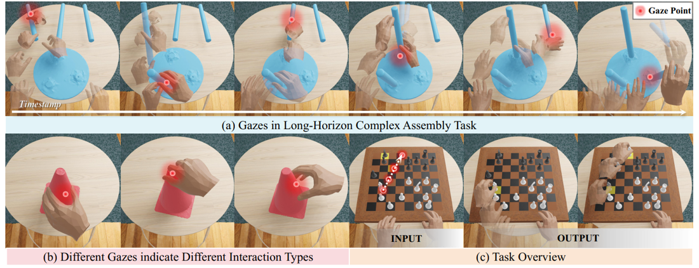
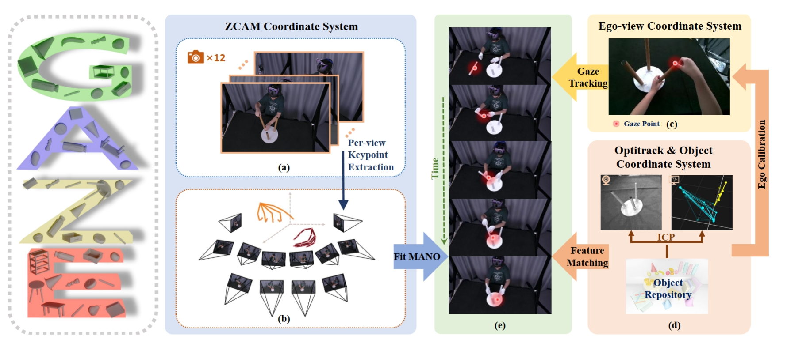

# Gaze-guided Hand-Object Interaction Synthesis: Dataset and Method

[paper](https://arxiv.org/abs/2403.16169) |
[video](https://www.youtube.com/watch?v=BR9qkQQpUfg) | 
[project page](https://takiee.github.io/gaze-hoi/)
## Dataset

Download link: [GoogleDrive](https://drive.google.com/drive/folders/1_3i8Pw_GLx4lDmULPVxJMWNG8fTa2rzY?usp=drive_link)
### Data Structure
```
release_data/
├── 0001/
│   ├── mano/
│   │   ├── poses_left.npy 
│   │   └── poses_right.npy 
│   ├── 001_book_4_pose_trans.npy
│   ├── 007_pen_3_blue_pose_trans.npy
│   ├── 007_pen_4_green_pose_trans.npy
│   ├── 007_pen_5_orange_pose_trans.npy
│   ├── ego_calib.npy
│   ├── gaze.npy # gaze ray
│   ├── gaze_point.npy
│   └── info.pkl # Metadata, including active object labels, hand flags, and other details.
├── 0002/
│   ├── ...
└── ...
```


### Hand Model Requirements

This project requires the following components for mapping pose and shape parameters to hand joints and vertices:

1. **[Manotorch](https://github.com/lixiny/manotorch)**: A PyTorch-based library for handling MANO models. Please follow the installation instructions provided on the [Manotorch GitHub repository](https://github.com/lixiny/manotorch).

2. **MANO Model Files**: The MANO model files can be downloaded from the official [MANO website](https://mano.is.tue.mpg.de/). Follow the instructions on the site to obtain the required files.

### Load Data
You can use the following script as a reference to read the required data:

```
python scripts/read_data.py --seq_id 1
```


- **`--seq_id`**: Specifies the sequence ID of the data you want to read.


## Citation
If you find our work useful in your research, please consider citing:

```
@misc{GazeHOI,
      title={Gaze-guided Hand-Object Interaction Synthesis: Dataset and Method}, 
      author={Jie Tian and Ran Ji and Lingxiao Yang and Suting Ni and Yuexin Ma and Lan Xu and Jingyi Yu and Ye Shi and Jingya Wang},
      year={2024},
      eprint={2403.16169},
      archivePrefix={arXiv},
      primaryClass={cs.CV},
      url={https://arxiv.org/abs/2403.16169}, 
}
```
